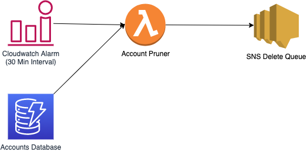

# AWS Account Auto Deployment

** WIP ** 
Please see TODO.md for things which are beyond broken currently.

## Introduction

This project is aimed to allow deployment of AWS accounts though a Slack chatbot

## Installation

** WIP **
Note, this won't currently work properly.

Email validation will require an external domain to work with.
Find one to enter into the config.tfvars which you have control over.

```
mv CHANGEME.config.tfvars config.tfvars
```

Update config.tfvars as appropriate

```
terragrunt apply
```

## Project aims

Create accounts on demand through a slack account. Each account should be able to have a set expiry date. 
Essentially a way of doing testing without running up massive bills (Lesson Learnt - and yeah.. it was my personal account, and yeah.. it was my personal credit card which took the damage)

The project should be essentially free in terms of running cost - the solution can't be more expensive the problem ;)
(So a serverless design works best)

## System Design

Firstly please note this is a work in progress. Some things are slightly in the wrong place, not variablised or modularised as well as they should be.
I hope to get this fixed soon.

### System Interaction


### System Pruning


### System Account Verification

